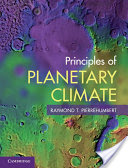

## planetary_climate
This repository contains Python utilities for the book
"Principles of Planetary Climate", by Raymond T. Pierrehumbert

### ClimateUtilities
Folder containing the original *ClimateUtilities*, ported to for Python 3.
Developed with the goal to have a stand-alone set of modules available
for all required computational tasks.
    
### cu_sp (ClimateUtilities with SciPy)
Same as "ClimateUtilities", but with simplified code-base due to the
dependence on the Python packages *pandas* and *scipy*.

    * gases.py ...... physical properties of some gases important for planetary atmospheres
                    includes the corresponding *DataFrame* structures
    * math_demos.py . demonstrates important mathematical tools for climate-calculations
    * math_demos.ipynb ... corresponding IPython-notebook
    * phys.py ....... some physical constants
    * planets.py .... physical properties of planets, and some moons
                    includes the corresponding *DataFrame* structures
    * satvp.py ...... functions for the determination of *saturation vapor pressure*,
                    and for the calculation of the *moist adiabate*
    * setpath.py .... adds the current folder to the IPython-path

### chapter_1
*IPython notebook* solutions for the exercises in Chapter 1
